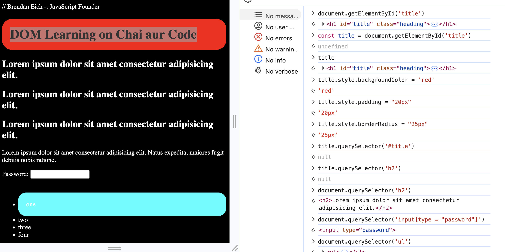
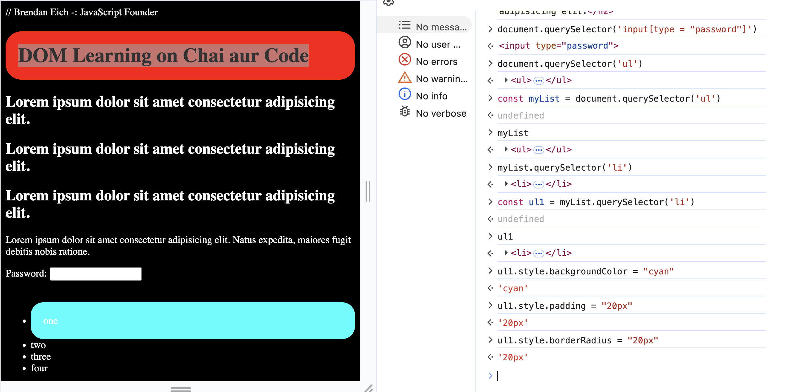

## DOM Concept
>Selecting the Element `Consider 01.html code file and use Dev Tools On chrome browser `-> ***command+option+j***
#### img1.1
>Targeting H1 Header , then changing background color, Add padding, change border radius

#### img1.2
>Selecting List Element

